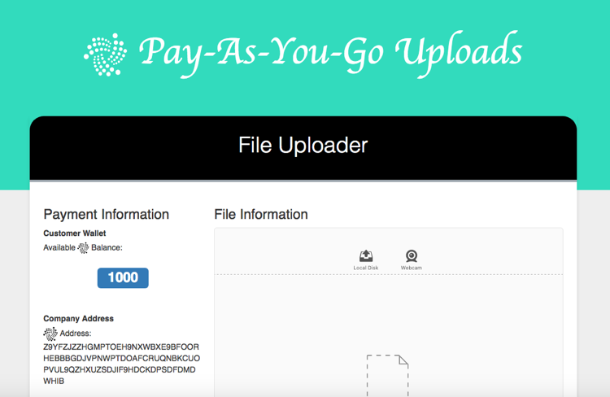

This is a tutorial on how to develop a proof-of-concept upload application using IOTA as a payment strategy. While IOTA was designed to enable the Internet-of-Things, its lack of fees also makes it great for micropayments, allowing it to be used for on-demand or pay-as-you-go services. In this tutorial, we will explore what a pay-as-you-go uploading service could look like.

We assume that you are already familiar with the basics of using the [IOTA JavaScript API](https://github.com/iotaledger/iota.lib.js) to generate addresses and make payments. If not, please review the [introductory level tutorial](https://learn.iota.org/tutorial/payments-and-messaging-leaderboard), and come back afterward to continue.

### Project Structure
The project is divided into client and server components, but we will focus only on the client, as it has all of the logic. In places, the client uses ES6 syntax, and the UI is developed using React. It is not necessary to be familiar with either, as the application logic is encapsulated from the UI. Those curious about the server code can review it directly, as it is short and commented.

### Setup
Ensure you have two seeds, including one to a wallet that has a balance.

## Functionality Overview
In this section, we’ll discuss the functionality we require and demonstrate how it is performed. There are two actors in this example, and both are shown on the same page. First, we will be simulating a company which is selling the upload service, and secondly, we will simulate a customer using that service.

### Company
The company is providing the upload service. To do this, the company will require a seed for the company wallet. Ideally, the company payment address would be provided to the client from the server, but in our case, it is easier to allow entry of the company seed in the UI. To do so, open the panel on the right hand side of the screen and enter in a seed.
Once the seed is entered, **the wallet data will be loaded** and a payment address will be generated. This will be populated in the main section of the application.

### Customer
To use the upload service, the customer must provide a seed to a wallet that has a balance. Once the balance is verified, the upload portion of the application becomes active. The upload component is provided by http://uppy.io which has a slick interface allowing for multiple resumable uploads. Once the customer starts to upload the files, the software will monitor the upload progress, and after the threshold of 1 mb has been reached, it will pause the upload and create a transaction with a payment based on the number of bytes uploaded. Once the transaction is successful, the upload resumes until the 1mb threshold has been met again. When the file is fully uploaded, one final payment is made. 

## Code
Now that we’ve had an overview of the application features, let’s take a look at some of the code. We will be focusing on the _wallet.js_, _payments.js_, _uploadManager.js_, and _uploader.js_ files. These files will be using APIs from [iota.lib.js](https://github.com/iotaledger/iota.lib.js) and [Uppy](https://github.com/transloadit/uppy). Feel free to review the docs for each if you need any further information. You will also likely notice the stateUpdater object in the following code samples. It is used to update the UI state.

### Generating the Company Address
When a Company seed is entered and the Set Seed button is clicked,the setCompanySeed function is called, which updates the UI and makes a standard call to the iota.lib.js API to generate the address. This should be familiar to anyone who has read the [leaderboard example](https://learn.iota.org/tutorial/payments-and-messaging-leaderboard). After the address is generated, the UI is updated again.

```javascript
export function setCompanySeed(seed) {
  // Update UI with Company seed
  stateUpdater.setCompanySeed(seed)

  // Deterministically generates a new address 
  // with checksum for the specified seed
  iota.api.getNewAddress(seed, { checksum: true }, (err, address) => {
    if (err) {
      // If there was an error generating an address
      // reset the seed to allow for reentry
      stateUpdater.setCompanySeed(null)
    } else {
      // Update the UI with the Company address
      stateUpdater.setCompanyAddress(address)
    }
  })
}
```

### Verifying the Customer Balance
To verify the Customer balance, the Customer will need to enter a seed. Once the seed is entered, the UI is updated with seed, the account information is retrieved from the API, and the Customer balance is set in the UI.

```javascript
export function setCustomerSeed(seed) {
  // Update UI with Customer seed
  stateUpdater.setCustomerSeed(seed)

  // Gets account information for the specified seed
  iota.api.getAccountData(seed, (err, accountData) => {
    if (err) {
      // If there was an error getting the account data
      // reset the seed to allow for reentry
      stateUpdater.setCustomerSeed(null)
    } else {
      // Update the UI with the Customer balance
      stateUpdater.setCustomerBalance(accountData.balance)
    }
  })
}
```

### Configuring Uppy
To upload files, we are using the [Uppy library](https://uppy.io/). Currently, it is a work in progress, so they reserve the right to change the API at any time, and they also caution that it should not be used in a production environment. But, it will do just fine for our purposes. Uppy is designed to be completely modular, with all logic residing in plugins that are added to a coordinator object with [an API](https://uppy.io/api/) that consists of two setup methods and status events. The documentation is not great at this time, so if you are interested in learning more, prepare to do some digging through the code.

The desired behavior of the application is to allow the Customer to add files to the upload, but not to start the uploads automatically so that the Customer can decide when to start being charged. It also will keep track of each individual file that is being uploaded so that the progress and payments for each individual file can be identified. When the application starts, the following code is run to configure Uppy.

```javascript
// Initialize Uppy with autoProceed: false so that uploads
// do not start automaticlly.
const uppy = Uppy({ autoProceed: false, debug: true })

// Create a PaidUpload instance for each file that is uploaded
uppy.on('core:upload-started', (fileId, upload) => {
  // Encapsulate the Uppy fileId and upload into an object
  // that will keep track of progress and payments
  uploaders[fileId] = new PaidUpload(fileId, upload)
})
```

The Uppy UI (DashboardUI) we are using adds itself to the page when Uppy is initialized. Due to the use of React, the intialization code needs to be separated so that it can run when the DashboardUI is first displayed. The initilization code should ensure that the application has a nice UI, pausable/resumable uploads, and that it can get files from multiple places.

```javascript
// Called once to initialize the Uppy UI
export function initalizeUploader(config) {
  // UI plugin for friendly display
  uppy.use(Dashboard, config)
    // Allows webcam video to be uploaded
    .use(Webcam, { target: Dashboard })
    // Displays information messages
    .use(Informer, { target: Dashboard })
    // File uploading protocol that allows uploads to be paused/resumed
    .use(Tus10, { endpoint: `//localhost:${WEB_PORT}/files` })

  // Display the configured Uppy UI
  uppy.run()
}
```

### Uploading a File
Now that we have the UI initialized, we can add files to the Uppy Dashboard. Since we have specified that the uploads should not start automatically, we will need to click the upload button to begin. Once clicked, the upload will start and the _*core:upload-started*_ event will fire, causing a new PaidUpload object to be created. The PaidUpload constructor adds an `onProgress` handler to the `upload` object to determine when a payment needs to be made. Unfortunately, Uppy does not expose this functionality on a per-file basis, so we have to make sure to call Uppy's original `onProgress` handler before continuing with the code that we need to execute.

```javascript
constructor(fileId, upload) {
  ...

  // Initialize all byte fields to 0
  // assumes upload has not been resumed
  this.bytesPaid = 0
  this.bytesPendingPayment = 0
  this.bytesUploaded = 0

  // Save original onProgress handler
  const originalOnProgress = upload.options.onProgress
  // eslint-disable-next-line no-param-reassign
  upload.options.onProgress = (bytesUploaded, bytesTotal) => {
    // Invoke original onProgress handler to avoid
    // possible breakage of Uppy functionality
    originalOnProgress(bytesUploaded, bytesTotal)

    // Process the uploaded bytes
    this.addBytesToUpload(bytesUploaded)
  }
}
```

### Calculating Payment Due
While the file is uploading, the `onProgress` handler we added in the `PaidUpload` constructor will be called periodically with the cumulative bytes that have been uploaded so far, as well as the total size of the file in bytes. We will need to determine whether the upload should continue or whether it should be paused and a payment should be made. In our app, we are going to charge users 1 IOTA for every MB uploaded. We will keep track of the number of bytes that have been paid with confirmed transactions, as well as the number of bytes that have pending payments. (Theoretically, uploads should only continue once a payment is confirmed, but due to the way the Uppy Dashboard works, uploads can be resumed before a payment is processed.) Once the number of unpaid bytes is calculated, we'll make a payment.

```javascript
addBytesToUpload(bytesUploaded) {
  // To avoid double charging Customers for uploaded bytes
  // include the bytes that already have a transaction
  // created or are "pending" confirm
  const totalPendingBytes = this.bytesPaid + this.bytesPendingPayment
  const unpaidBytes = bytesUploaded - totalPendingBytes

  // If there are any bytes that have not been paid,
  // pause the upload and make a new payment
  if (unpaidBytes > 0) {
    this.pauseUpload()
    this.makePayment(unpaidBytes)
  }
}

makePayment(unpaidBytes) {
  // Calculate the amount of IOTA due, rounding up.
  const paymentAmount = Math.ceil(parseInt(unpaidBytes, 10) / bytesForOneIota)
  // Call wallet API to complete the payment, generating a
  // new payment id in the process
  makePayment(this.fileId, this.getNextPaymentId(), paymentAmount)
}
```


## Exercises
1.	IOTA addresses are secure for multiple payments as long as nothing is spent from that address. To ensure that a company can spend in the middle of an upload:
    1.	generate a new address for each payment
    1.	add the file id as a message to the transaction so that transactions can be rolled up into a full payment.
1.	Currently, if the page is refreshed when an upload is paused, and the Customer resumes the upload, the application will charge the Customer for the full size of the file, instead of calculating previous payments. Use the file id added to the transactions in the previous exercise to calculate existing payments to ensure the Customer is charged fairly.
1. Uppy has additional plugins for Dropbox and Google Drive. Enable the file uploader to get files from both.

